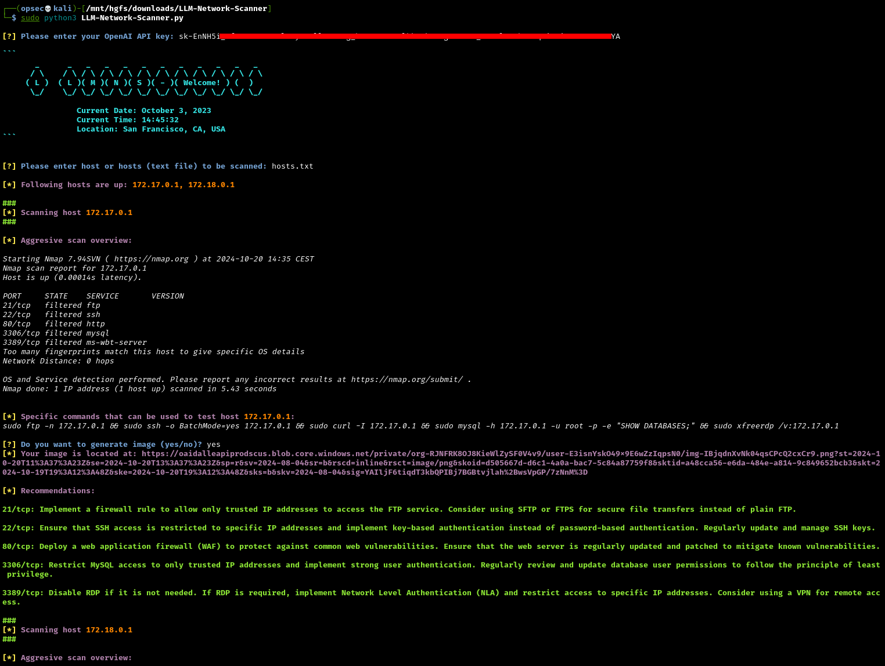

# LLM-Network-Scanner

LLM-Network-Scanner is a powerful tool that leverages the OpenAI API and advanced Natural Language Processing (NLP) models to identify and scan network hosts. By using state-of-the-art language models, it automates the process of host discovery, vulnerability scanning, and network analysis. This tool helps network administrators efficiently assess and secure their infrastructure by providing intelligent insights, scanning results, and potential vulnerability reports for each identified host in the network.

Main functionalities:
- Create a custom welcoming banner
- Check the current status of given hosts
- Scan online hosts for open ports
- Perform a detailed scan on open ports
- Find out best tools to dive deeper into specific services
- Generate a custom summary in the image format
- Create a recommendations for findings of each host
- Generate a PDF report with host informations and recommendations

## Demo

Below is a screenshot from one of the development versions of LLM-Network-Scanner. In <span style="color:red">**red**</span>, you can see commands that were generated by OpenAI API and then executed locally on Kali Linux 2024.



## Dependencies

LLM Network Scanner makes use of:
- OpenAI Python library (`pip3 install openai`)
- FPDF Python library (`pip3 install fpdf`)

## Testing on Docker

We have used [Docker](https://www.docker.com/) environement with [opencanary](https://github.com/thinkst/opencanary) instance to locally test Network Scanner.

```bash
sudo docker-compose up latest
```

Config files:

```bash
# docker-compose.yml
###
image: "opencanary"
#network_mode: "host"
ports:
# FTP
- "21:21"
# SSH
- "22:22"
# TFTP
- "69:69"
# HTTP
- "80:80"
# MYSQL
- "3306:3306"
# RDP
- "3389:3389"

# .opencanary.conf
"tftp.enabled": true,
"rdp.enabled": true,
"ssh.enabled": true,
"mysql.enabled": true,
"https.enabled": false,
"ftp.enabled": true,
"http.enabled": true,
```

## Testing without Docker

Because `Docker-compose` is sometimes really hard to install, there is also way to run python environment and start up `opencanaryd`:

```bash
sudo apt-get install python3-dev python3-pip python3-virtualenv python3-venv python3-scapy libssl-dev libpcap-dev
virtualenv env/
. env/bin/activate
pip install opencanary
opencanaryd --copyconfig
sudo nano /etc/opencanaryd/copencanary.conf
opencanary --start
```

## Disclaimer

LLM-Network-Scanner repository is intended solely for the purpose of testing and validating scopes of legitimate penetration tests. These tools are designed to assist administrators and auditors in ensuring that networks and devices adhere to predefined standards and guidelines.

The creators and maintainers of this tool are not responsible for any misuse or legal implications arising from its use. Always ensure that you have the proper authorization before performing any configuration analysis.